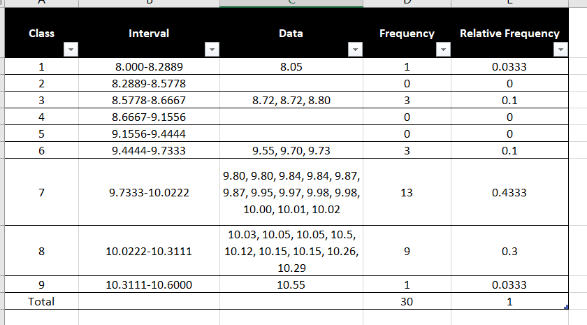

```{r setup, include=FALSE}
knitr::opts_chunk$set(echo = TRUE)
```

# Questions Completed 15 /15
## Question 1
The courses final grade is composed of seven different categories the add together for the final grade.

1) Assignments (4 Total) = 15% (3.75% each)

2) Laboratories = 10%
  - Possibly (not likely) 16 Lab/minilab reports - one lab per week usually
  - Additional class room exercises
  - Grades allotted through drop-boxes and Rubrics

3) Projects (2 Total) = 10%  (ratio of 1:2 assessment - 1/3 Project 1, 2/3 Project 2)

4) In class Quizzes = 10%

5) Chapter Quizzes = 5%

6) Midterm Exams (2 Total) = 20% (10% each)

7) Final = 30%

Grades are broken down in a typical A-F grading scale with no curving(rounding up to 4 decimal places).


- A (90s) 
- B (80s) 
- C (60s and 70s) 
- D (50s) 
- F (<50) 

## Question 2
### a)


```{r}
ddt = read.csv("DDT.csv")
m=with(ddt, as.numeric(factor(MILE))) # A
length(unique(m)) #B
coplot(LENGTH~WEIGHT|RIVER*SPECIES,data=ddt,col=m)

```


### b)

The three lower conditional plots show that for CCATFISH,the relationship between LENGTH against WEIGHT for the rivers, FCM, LCM, and SCM through the use of a conditional scatter plot.  

### c)

Line A converts the levels of factors of MILE to a numeric vector.

### d)

Line B represents the number of unique MILES held with in the numeric vector m. The total equals 17. 

### e)

The top six plots are empty as there is no corresponding data related to those combinations. The species LMBASS and SMBUFFALO are not found within the rivers FCM, LCM, and SCM.

### f)
```{r}
library(dplyr ,warn.conflicts = FALSE)
ddt %>% filter(SPECIES == "CCATFISH" &  RIVER == "FCM" ) %>% summarize(mean = mean(DDT))

```


## Question 3
### a) Length of maximum span (feet)

Quantitative

### b) Number of vehicle lanes

Quantitative

### c) Toll bridge (yes or no)

Qualitative

### d) Average daily traffic

Quantitative

### e) Condition of deck (good, fair, or poor)

Qualitative

### f) Bypass or detour length (miles)

Quantitative

### g) Route type (interstate, U.S., state, county, or city)

Qualitative

## Question 4

### a)

  - simple random sample 
  - stratified random sampling
  - cluster sampling
  - systematic sampling
  
### b)
  - Simple random sampling is when every item in a population has an equal chance of being selected for use. The selection entirely depends on luck/probability. 
 - Stratified random sampling divides a population in homogeneous sub-population, called strata. Experimental units are more similar within strata then across strata. Random sampling is taken from each strata and then units are  combined to form a complete sample. 
 - Cluster sampling is when a population is split into clusters from which some are selected. All the selected cluster's members will be include in the sample. 
 - Systematic sampling involves systematically selecting every kth (where k is some positive number) experimental unit from a list of all experimental units. 

## Question 5

### a)
```{r}
mtbe=read.csv("MTBE.csv", header=TRUE) # You will need to change the address
head(mtbe) # First six lines
dim(mtbe) # rows and columns
ind=sample(1:223,5,replace=FALSE) # random indices
mtbe[ind,]
```

#### i)

```{r}
mtbeo=na.omit(mtbe)
```


#### ii)

```{r}
depth=mtbeo[mtbeo$Aquifier=="Bedrock",]$Depth
sd(depth)
```


## Question 6

### a)
```{r}
eq=read.csv("EARTHQUAKE.csv", header=TRUE) # You will need to change the address
head(eq) # First six lines
dim(eq) # rows and columns
ind=sample(1:2929,5,replace=FALSE) # random indices
eq[ind,]
```

#### i)
```{r}
plot(ts(eq$MAG))
```


#### ii)
```{r}
magn=eq$MAGNITUDE
median(magn)
```

## Question 7

### a)

The data-collection method is a designed experiment. A method of data-collection where the researcher exerts full control over the characteristics of the experimental units sampled. These experiments typically involve an experimental group and a control group. 

### b)

The population is all fish in the Tennessee River and its tributaries, the sample derived from the population is a total of 144 fish. 

### c)

The qualitative variables equal the river the fish are found and their species (known as RIVER and SPECIES inside the DDT data).

## Question 8
```{r}
pareto <- function(x, mn = "Pareto barplot", ...) {  # x is a vector
  x.tab = table(x)
  xx.tab = sort(x.tab, decreasing = TRUE, index.return = FALSE)
  cumsum(as.vector(xx.tab)) -> cs
  length(x.tab) -> lenx
  bp <- barplot(xx.tab, ylim = c(0,max(cs)),las = 2)
  lb <- seq(0,cs[lenx], l = 11)
  axis(side = 4, at = lb, labels = paste(seq(0, 100, length = 11), "%", sep = ""), las = 1, line = -1, col = "Blue", col.axis = "Red")
  for(i in 1:(lenx-1)){
    segments(bp[i], cs[i], bp[i+1], cs[i+1], col = i, lwd = 2)
  }
  title(main = mn, ...)
}
```


### a)

The data is represented by a bar graph. 

### b)

The variable measured for each of the 106 robot design is the type of robotic limb. 15 had no limbs, 8 both legs and wheels, 63 had only legs, and 20 had only wheels. 

### c)

The most popular robot design based on the graph is one with only legs. 

### d) 

```{r}
freq=c(15,8,63,20)
RL=c("None","Both","LegsO","WheelsO")
l=rep(RL,freq)

tab <- table(l)
tab
tab <- round((table(l)/length(l)), digits = 4)
tab
```


### e)

```{r}
pareto(l)
```

## Question 9

### a)

```{r}
freq=c(32,8, 12)
MS=c("Windows","Explorer","Office")
m=rep(MS,freq)

tab <- table(m)
tab
pie(tab, labels = MS, main = "Microsoft program security issues", col = c(10 , 5, 15))
tab <- round((table(m)/length(m)), digits = 4)
tab
```

The product Explorer had the lowest proportion (12%) of security issues in 2012.

### b) 

```{r}
freq=c(6,8,22,3,11)
bulletins=c("Denial", "Disclosure", "Execution", "Spoofing", "Elevation")
bt=rep(bulletins,freq)
pareto(bt)
```

Because approximately 44% expected repercussion of the vulnerability is due to the Remote Code Execution, Microsoft should focusing on increasing the security of that repercussion first. 


## Question 10

```{r}
swe=read.csv("SWDEFECTS.CSV", header=TRUE) # You will need to change the address
head(swe)
tab <-table(swe$defect)
dfect <- c("No Defect Present", "Defect Present")
pie(tab, labels = dfect, main = "Pie", col = c(10 , 5))
new_tab <- round(prop.table(tab), digits = 4)
new_tab
```

Most of the software does not contain any defects. However a small percentage (around 10%) do meaning it is unlikely a customer will receive defective software but not impossible.


## Question 11

### a)
```{r}
library(sets)
voltage.df = read.csv("VOLTAGE.CSV")
old<-subset(voltage.df,subset=LOCATION=="OLD")
old$VOLTAGE->vto
vto
max(vto)
min(vto)
lepto<-min(vto)-0.05
repto<-max(vto)+0.05
rngeo<-repto-lepto
inco<-rngeo/9
inco
seq(lepto, repto,by=inco)->clo
clo
cvto<-cut(vto,breaks=clo)
old.tab=table(cvto)
old.tab
barplot(old.tab,space=0,main="Frequency Histogram(OLD)",las=2)

```


{ width=80% }


### b)

```{r}
stem(vto)
```
The stem-and-leaf plot shows more of the actual data but there is a lost of pattern in the spread of voltages. This makes it less useful in the ability it visual represent data.

### c)
```{r}
new<-subset(voltage.df,subset=LOCATION=="NEW")
new$VOLTAGE->vtn
vtn
max(vtn)
min(vtn)
vtn
lept<-min(vtn)-0.05
rept<-max(vtn)+0.05
rnge<-rept-lept
inc<-rnge/9
inc
seq(lept, rept,by=inc)->cl
cl
cvtn<-cut(vtn,breaks=cl)
new.tab=table(cvtn)
barplot(new.tab,space=0,main="Frequency Histogram(NEW)",las=2)
```


### d)

The test devices in the new location is not as tightly clustered around 10 as the old voltage, it does have many values above 9.2. However the old location only had 3 voltages below the good level while the new has 7. This might be significant given the cost and benefits involved, but the results on the which is better for implementation is unclear. There is a distinct difference between the two distributions. 

### e)

```{r}
library(DescTools)
#Old Location
mean(vto)
median(vto)
Mode(vto)

#New Location
mean(vtn)
median(vtn)
Mode(vtn)
```
 The measure of central tendency for the old location centers around 9
9.80-9.98, while the new location as a central tendency around 9.2-9.45. The old location also has more repeating values having a told of 8 modes with the new location only having 2 meaning both process have a higher chance of picking a nonconforming device if chosen randomly.  

### f)
```{r}
old_pop.sd <-sd(vto)*sqrt((length(vto)-1)/(length(vto)))
old_pop.mean <-mean(vto)
(10.50-old_pop.mean)/old_pop.sd
```


### g)
```{r}
new_pop.sd <-sd(vtn)*sqrt((length(vtn)-1)/(length(vtn)))
new_pop.mean <-mean(vtn)
(10.50-new_pop.mean)/new_pop.sd
```


### h) 
A value of 10.50 is more likely to occur at the old location as its z-score is lower. This lower score means 10.50 is closer to the mean and has more frequency on a bell curve. 

### i)
```{r}
boxplot(vto)
```
There are several possible outliers in the data as seen by the data points extending out beyond the "whiskers" on the box plot. 

### j)
```{r}
z <-scale(old$VOLTAGE)
old[abs(z)>3]
```

### k)
```{r}
boxplot(vtn)

```
It does not look like the book plot contains any possible outliers.

### l) 
```{r}
z <-scale(new$VOLTAGE)
new[abs(z)>3]
```

### m) 
```{r}
layout(matrix(1:2,nr=1,nc=2,byrow=TRUE))
boxplot(vto,main="Voltage (OLD)")
boxplot(vtn,main = "Voltage (NEW)")

```


## Question 12 
```{r}
roughpipe = read.csv("ROUGHPIPE.CSV")
t.test(roughpipe,conf.level = 0.95)
```
95 percent of the pipes lay within the interval [1.635802, 2.126198]

## Question 13

### a) 
```{r}
library(DescTools)
ants = read.csv("GOBIANTS.csv")
speciesnum = ants$AntSpecies
mean(speciesnum)
median(speciesnum)
Mode(speciesnum)
```

The mean is approximately 12.82, the median is 5, and the modes are 4 and 5. This means that the data set has outliers moving the average towards a larger number. By removing those outliers the mean would be closer the number 5. 

### b) 
As stated in a due to the mean having outliers skewing the mean results the median would be a better representation of the data. The median is the middle value in a data set meaning 50% of the data lies below this point and 50% above. 

### c)
```{r}
dry <- with(ants, ants[Region == "Dry Steppe",])
dryplant = dry$PlantCov

mean(dryplant)
median(dryplant)
Mode(dryplant)

```

### d) 
```{r}
gobbi <- with(ants, ants[Region == "Gobi Desert",])
gobbi
gplant = gobbi$PlantCov

mean(gplant)
median(gplant)
Mode(gplant)
```

### e)
 Yes the center for the two regions appears to be different as each metric of central tendency does not match up. The Dry Steppes center is around 40, and the Gobbi Desert center is around 28 based on the 3 values for each. 

## Question 14

### a) 

```{r}
galaxy <- read.csv("GALAXY2.csv")
library(ggplot2)
velocity = galaxy$VELOCITY
ggplot(galaxy, aes(x = velocity)) +
  geom_dotplot(fill = "pink", binwidth = 415)
```


### b) 

Yes there is evidence to support the double cluster theory based on the dot plot. As shown above can see two distinct clusters of velocities. This means that is more likely their are two different galaxies moving at different velocities then a singular galaxies swinging between two velocity intervals. 

### c)
```{r}
#"Overall Mean"
mean = mean(galaxy$VELOCITY)
mean

A1775A <- with(galaxy, galaxy[VELOCITY >= mean,])
A1775B <- with(galaxy, galaxy[VELOCITY < mean,])

#"Cluster A1775A"
mean(A1775A)
sd(A1775A)

#"Cluster A1775B"
mean(A1775B)
sd(A1775B)
```


### d) 
You would most likely find a galaxy velocity of 20,000 km/s in galaxy A1775B as it is the the slower galaxy with an average velocity of 19,462.24 which is closer to the 20,000 velocity then A1775A's mean velocity at 22,838.47 km/s.

## Question 15

```{r}
ggplot(ddt, aes(x=RIVER,y=LENGTH,fill=SPECIES)) + geom_boxplot() + ggtitle("Averi Bates FALL2022 DDT Boxplot")

```

