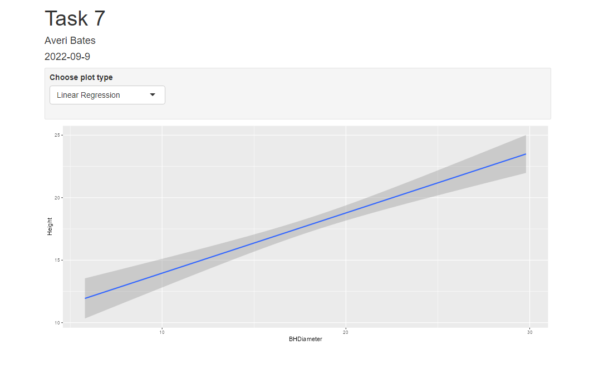
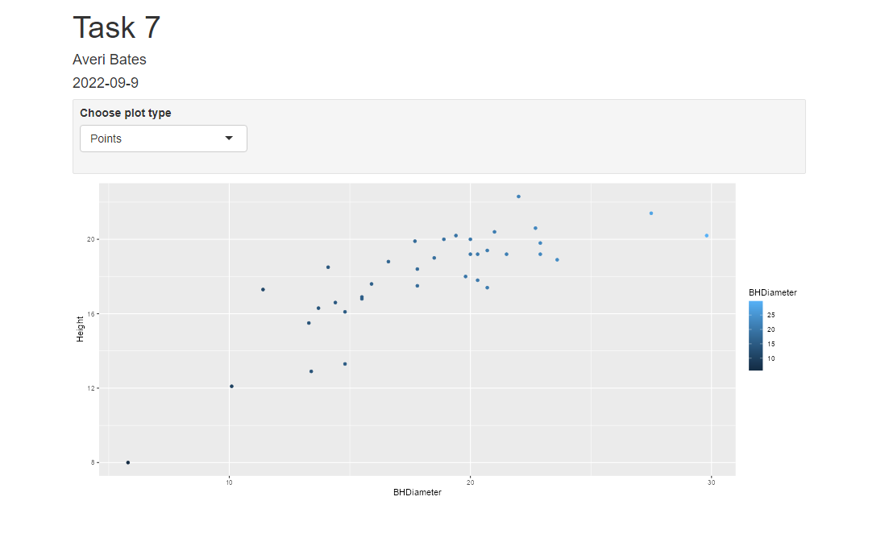
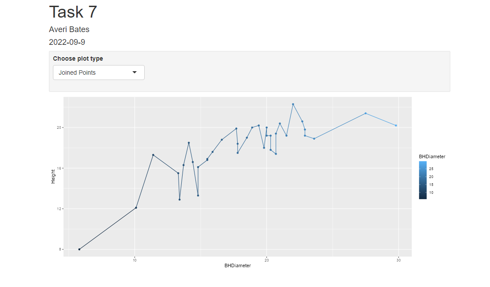

```{r setup, include=FALSE}
knitr::opts_chunk$set(echo = TRUE)
```
# Tasks

## Task 1

```{r}
getwd()
```

## Task 2

```{r}
spruce.df = read.csv("SPRUCE.csv")
head(spruce.df)
```


## Task 3
```{r}
plot(Height~BHDiameter, main = "Tree Height vs BHDiameter",
     xlab = "Breast Height Diamter (cm)", ylab = "Height of Tree (m)",
     pch = 21, bg = 'blue', cex = 1.2,
     xlim = c(0, max(BHDiameter)*1.1), ylim = c(0, max(Height)* 1.1),
     data = spruce.df)

```
There does not appear to be a straight line relationship within the graph. While there is a partial straight line the data curves and is thus better represented by a curve. 

```{r}
library(s20x)
lo = layout(matrix(1:3, nrow = 1, ncol = 3, byrow = T))
tsone = trendscatter(Height~BHDiameter, f= 0.5, data = spruce.df)
tstwo = trendscatter(Height~BHDiameter, f= 0.6, data = spruce.df)
tsthree = trendscatter(Height~BHDiameter, f= 0.7, data = spruce.df)
```

```{r}
spruce.lm = with(spruce.df, lm(Height~BHDiameter))

lo = layout(1)
with(spruce.df,
     plot(Height~BHDiameter, main = "Tree Height vs BHDiameter",
     xlab = "Breast Height Diamter (cm)", ylab = "Height of Tree (m)",
     pch = 21, bg = 'blue', cex = 1.2,
     xlim = c(0, max(BHDiameter)*1.1), ylim = c(0, max(Height)* 1.1),
     ))
abline(spruce.lm)
```
 A straight line is not appropriate for the given data as all three trendscatter f-values show a curve in the data making a curve a better fit. 

## Task 4
```{r}
lo = layout(matrix(1:4,nr = 2, nc = 2, byrow = T))
layout.show(4)


mycex = 1.0
# Regular Graph 
with(spruce.df,
     plot(Height~BHDiameter, main = "Tree Height vs BHDiameter",
     xlab = "Breast Height Diamter (cm)", ylab = "Height of Tree (m)",
     pch = 21, bg = 'blue', cex = 1.2,
     xlim = c(0, max(BHDiameter)*1.1), ylim = c(0, max(Height)* 1.1),
     ))
abline(spruce.lm)

yhat = fitted(spruce.lm)

#RSS Graph 
with(spruce.df,
     plot(Height~BHDiameter, main = "RSS",
     xlab = "Breast Height Diamter (cm)", ylab = "Height of Tree (m)",
     pch = 21, bg = 'blue', cex = mycex,
     xlim = c(0, max(BHDiameter)*1.1), ylim = c(0, max(Height)* 1.1),
     ))

with(spruce.df, {
  segments(BHDiameter, Height, BHDiameter, yhat)
})
abline(spruce.lm)

#MSS Graph 
with(spruce.df,
     plot(Height~BHDiameter, main = "MSS",
     xlab = "Breast Height Diamter (cm)", ylab = "Height of Tree (m)",
     pch = 21, bg = 'blue', cex = mycex,
     xlim = c(0, max(BHDiameter)*1.1), ylim = c(0, max(Height)* 1.1),
     ))
with(spruce.df, abline(h = mean(Height)))
with(spruce.df, segments(BHDiameter, mean(Height), BHDiameter, yhat, col = "red"))
abline(spruce.lm)

#TSS Graph
with(spruce.df,
     plot(Height~BHDiameter, main = "TSS",
     xlab = "Breast Height Diamter (cm)", ylab = "Height of Tree (m)",
     pch = 21, bg = 'blue', cex = mycex,
     xlim = c(0, max(BHDiameter)*1.1), ylim = c(0, max(Height)* 1.1),
     ))
with(spruce.df, abline(h = mean(Height)))
with(spruce.df, segments(BHDiameter, Height, BHDiameter, mean(Height), col = "green"))
```
```{r}
# Residual Sum of Squares 
RSS = with(spruce.df, sum((Height - yhat)^2))
RSS

# Model Sum of Squares
MSS = with(spruce.df, sum((yhat - mean(Height))^2))
MSS

# Total Sum of Squares 
TSS = with(spruce.df, sum((Height - mean(Height))^2))
TSS
```
```{r}
MSS/TSS
```
MSS/TSS is the multiple R squared. 0.6569146 means that approximately 65.7% of the height is explained through the mode BHDiameter. Its value of 0.6569 is not very large and thus gives the conclusion that a straight line is not the best fit for the data.

```{r}
#RSS + MSS = TSS 
RSS + MSS
TSS
```
MSS + RSS does equal TSS.

## Task 5
```{r}
summary(spruce.lm)
```

```{r}
coef(spruce.lm)
```

The slope equals 0.4814743.
The intercept is 9.1468390.  
The equation for the line of best fit equals y = 0.4814743x + 9.1468390

```{r}
predict(spruce.lm, data.frame(BHDiameter=c(15,18,20)))
```

## Task 6 
```{r}
library(ggplot2)
g=ggplot(spruce.df, aes(x=BHDiameter,y=Height,colour=BHDiameter))
g=g+geom_point() + geom_line()+ geom_smooth(method="lm")
g+ggtitle("Height Vs BHDiameter")
```


## Task 7
This is how you place images in RMD documents

<center>
{ width=80% }
{ width=80% }
{ width=80% }
</center>


## Me

```{r}
obj = lm(Height~BHDiameter, data = spruce.df)
summary(obj)
plot(Height~BHDiameter, data = spruce.df)
abline(obj)
library(s20x)
trendscatter(Height~BHDiameter,f=0.7, data=spruce.df)
```
